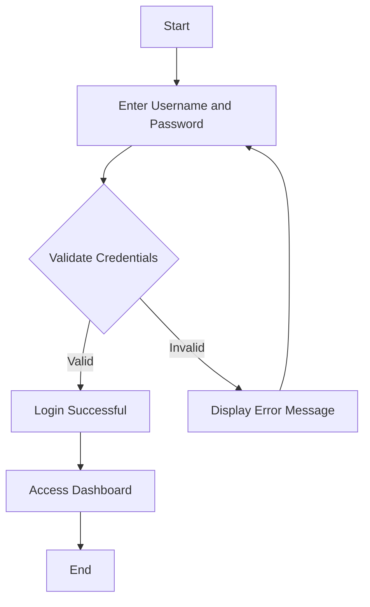

# Flowchart Example

This is a simple flowchart created with Mermaid.

```mermaid
flowchart TD
    A[Start] --> B[Enter Username and Password]
    B --> C{Validate Credentials}
    C -->|Valid| D[Login Successful]
    C -->|Invalid| E[Display Error Message]
    E --> B
    D --> F[Access Dashboard]
    F --> G[End]
```